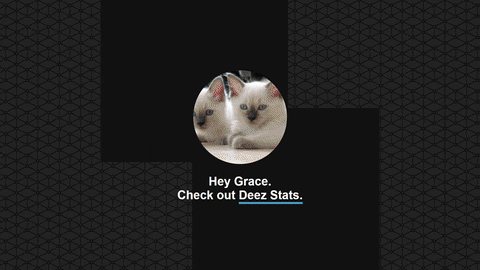

> [!IMPORTANT]
> Unfortunately, Deezer [have ended support](https://github.com/FoxxMD/multi-scrobbler/issues/175#issuecomment-2296776625) for their API and new app creation, so this repository is no longer maintained.
> 
> Thank you to everyone who logged in and tried Deez Stats during its operation!

---

<h1>🎵 Deez Stats</h1>
Analyze your Deezer listening history to discover how mainstream your music taste is.  

&nbsp;

&nbsp;

---

## Acknowledgements

- Built using the [Deezer Developer API](https://developers.deezer.com/) and [workers-rs](https://github.com/cloudflare/workers-rs)
- Concert image provided by [Vishnu R Nair](https://www.pexels.com/@vishnurnair)
- Icons provided by [IconMonstr](https://iconmonstr.com/)
- Pattern backgrounds provided by [Toptal](https://www.toptal.com/designers/subtlepatterns/)
- Counting animations created using [CountUp.js](https://github.com/inorganik/CountUp.js)
